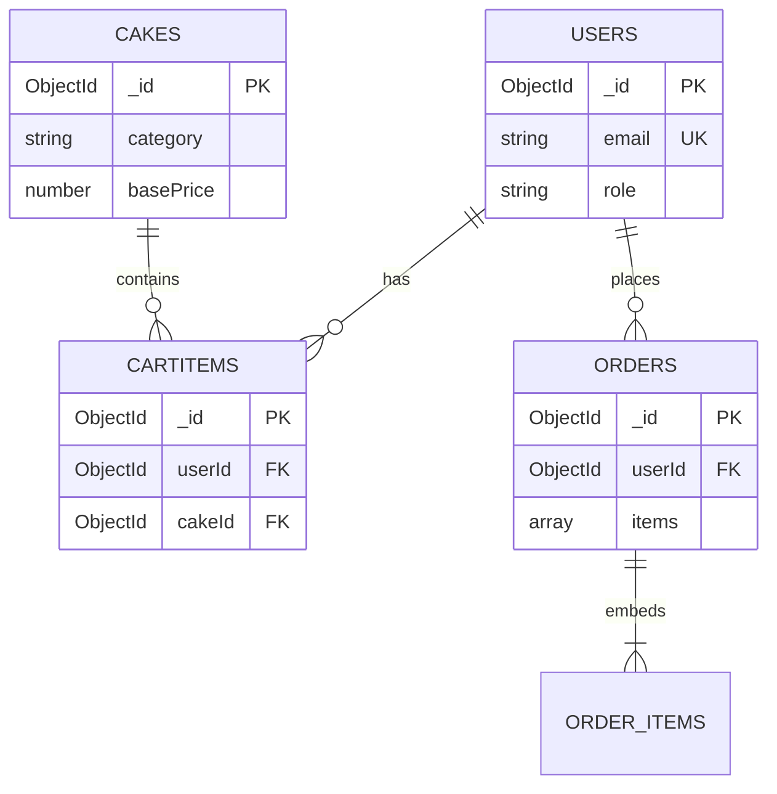

# MongoDB Database Design

## Cake Online Shopping App

**Database:** MongoDB  
**ODM:** Mongoose  
**Version:** 3.0  
**Date:** June 2026

---

## Architecture

```
Flutter App  ──HTTP/REST──►  Node.js API  ──Mongoose──►  MongoDB
```

---

## Collections

### `users`

| Field | Type | Constraints | Description |
|-------|------|-------------|-------------|
| _id | ObjectId | PK | Auto-generated |
| name | String | required | Full name |
| email | String | required, unique | Login email |
| phone | String | required | Contact number |
| passwordHash | String | required | bcrypt hash |
| role | String | CUSTOMER \| ADMIN | User role |
| createdAt | Date | auto | Timestamp |
| updatedAt | Date | auto | Timestamp |

**Indexes:** `email` (unique)

---

### `cakes`

| Field | Type | Constraints | Description |
|-------|------|-------------|-------------|
| _id | ObjectId | PK | Product ID |
| name | String | required | Cake name |
| description | String | | Description |
| category | String | enum | BIRTHDAY, WEDDING, etc. |
| basePrice | Number | required | Starting price |
| imageUrl | String | | Image URL |
| flavors | [String] | | Available flavors |
| sizes | [String] | | Available sizes |
| rating | Number | default 0 | 0–5 rating |
| inStock | Boolean | default true | Availability |

**Indexes:** `category`

---

### `cartitems`

| Field | Type | Constraints | Description |
|-------|------|-------------|-------------|
| _id | ObjectId | PK | Cart line ID |
| userId | ObjectId | ref: users | Owner |
| cakeId | ObjectId | ref: cakes | Product |
| quantity | Number | min 1 | Quantity |
| selectedSize | String | required | e.g. "1kg" |
| selectedFlavor | String | required | e.g. "Chocolate" |
| customMessage | String | optional | Icing message |
| unitPrice | Number | required | Price at add time |

**Indexes:** `userId`

---

### `orders`

| Field | Type | Constraints | Description |
|-------|------|-------------|-------------|
| _id | ObjectId | PK | Order ID |
| orderNumber | String | unique | e.g. ORD-1730000000 |
| userId | ObjectId | ref: users | Customer |
| totalAmount | Number | required | Order total |
| status | String | enum | PENDING → DELIVERED |
| deliveryAddress | String | required | Delivery location |
| deliveryDate | Number | required | Unix ms timestamp |
| paymentMethod | String | required | COD, MOCK_CARD |
| items | [OrderItem] | embedded | Line items (see below) |
| createdAt | Date | auto | Order timestamp |

**Embedded `items` subdocument:**

| Field | Type | Description |
|-------|------|-------------|
| cakeId | ObjectId | Product reference |
| cakeName | String | Name snapshot |
| quantity | Number | Qty ordered |
| size | String | Selected size |
| flavor | String | Selected flavor |
| customMessage | String? | Custom message |
| price | Number | Line total |

**Indexes:** `userId`, `orderNumber` (unique), `status`

---

## Entity Relationship



---

## Connection String

**Local MongoDB:**
```
mongodb://localhost:27017/cake_shop
```

**MongoDB Atlas (cloud):**
```
mongodb+srv://<username>:<password>@cluster.mongodb.net/cake_shop
```

Set in `backend/.env` as `MONGODB_URI`.

---

## Seed Data

```bash
cd backend
npm install
npm run seed
```

Creates demo users and 7 sample cakes.

---

## Mongoose Models

Located in `backend/src/models/`:
- `User.js`
- `Cake.js`
- `CartItem.js`
- `Order.js`
