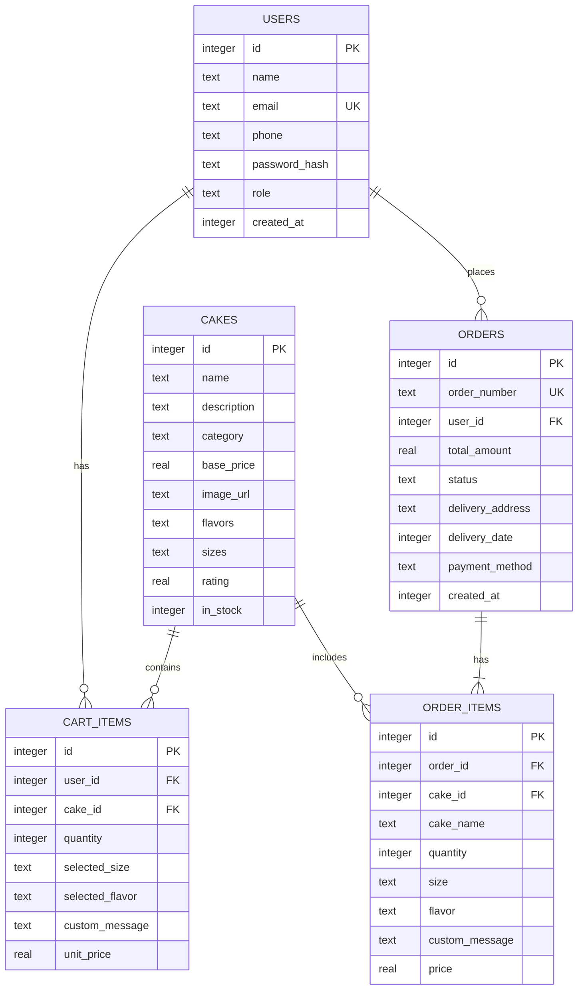

# Database Design

## Cake Online Shopping App

**Document ID:** DB-CAKE-001  
**Version:** 3.0  
**Date:** June 2026

> **Current stack:** MongoDB with Mongoose ODM. Full schema: [`database/mongodb_schema.md`](../database/mongodb_schema.md)

---

## 1. Overview

The application uses **MongoDB** as the primary database, accessed by the **Node.js** backend via **Mongoose**. The Flutter app communicates with MongoDB only through the REST API (no direct DB connection).

| Item | Value |
|------|-------|
| Database | MongoDB |
| ODM | Mongoose |
| Database name | `cake_shop` |
| Collections | `users`, `cakes`, `cartitems`, `orders` |

---

## 2. Entity-Relationship Diagram



---

## 3. Table Specifications

### 3.1 users

| Column | Type | Constraints | Description |
|--------|------|-------------|-------------|
| id | INTEGER | PK, AUTOINCREMENT | Unique user ID |
| name | TEXT | NOT NULL | Full name |
| email | TEXT | NOT NULL, UNIQUE | Login email |
| phone | TEXT | NOT NULL | Contact number |
| password_hash | TEXT | NOT NULL | Hashed password |
| role | TEXT | NOT NULL, DEFAULT 'CUSTOMER' | CUSTOMER or ADMIN |
| created_at | INTEGER | NOT NULL | Unix timestamp |

**Indexes:** `idx_users_email` on `email`

---

### 3.2 cakes

| Column | Type | Constraints | Description |
|--------|------|-------------|-------------|
| id | INTEGER | PK, AUTOINCREMENT | Product ID |
| name | TEXT | NOT NULL | Cake name |
| description | TEXT | | Product description |
| category | TEXT | NOT NULL | BIRTHDAY, WEDDING, etc. |
| base_price | REAL | NOT NULL | Starting price |
| image_url | TEXT | | Image path or URL |
| flavors | TEXT | NOT NULL | JSON array: ["Vanilla","Chocolate"] |
| sizes | TEXT | NOT NULL | JSON array: ["500g","1kg","2kg"] |
| rating | REAL | DEFAULT 0.0 | Average rating 0–5 |
| in_stock | INTEGER | DEFAULT 1 | 1 = in stock, 0 = out |

**Indexes:** `idx_cakes_category` on `category`

---

### 3.3 cart_items

| Column | Type | Constraints | Description |
|--------|------|-------------|-------------|
| id | INTEGER | PK, AUTOINCREMENT | Cart line ID |
| user_id | INTEGER | FK → users.id, NOT NULL | Owner |
| cake_id | INTEGER | FK → cakes.id, NOT NULL | Product |
| quantity | INTEGER | NOT NULL, DEFAULT 1 | Quantity |
| selected_size | TEXT | NOT NULL | e.g. "1kg" |
| selected_flavor | TEXT | NOT NULL | e.g. "Chocolate" |
| custom_message | TEXT | | Optional icing message |
| unit_price | REAL | NOT NULL | Price at time of add |

**Foreign Keys:**
- `user_id` REFERENCES `users(id)` ON DELETE CASCADE
- `cake_id` REFERENCES `cakes(id)` ON DELETE CASCADE

---

### 3.4 orders

| Column | Type | Constraints | Description |
|--------|------|-------------|-------------|
| id | INTEGER | PK, AUTOINCREMENT | Order ID |
| order_number | TEXT | NOT NULL, UNIQUE | e.g. "ORD-20260701-001" |
| user_id | INTEGER | FK → users.id, NOT NULL | Customer |
| total_amount | REAL | NOT NULL | Order total |
| status | TEXT | NOT NULL, DEFAULT 'PENDING' | Order status |
| delivery_address | TEXT | NOT NULL | Delivery location |
| delivery_date | INTEGER | NOT NULL | Requested delivery date |
| payment_method | TEXT | NOT NULL | COD, CARD, etc. |
| created_at | INTEGER | NOT NULL | Order timestamp |

**Indexes:** `idx_orders_user_id` on `user_id`, `idx_orders_status` on `status`

---

### 3.5 order_items

| Column | Type | Constraints | Description |
|--------|------|-------------|-------------|
| id | INTEGER | PK, AUTOINCREMENT | Line item ID |
| order_id | INTEGER | FK → orders.id, NOT NULL | Parent order |
| cake_id | INTEGER | FK → cakes.id, NOT NULL | Product reference |
| cake_name | TEXT | NOT NULL | Snapshot of name at order time |
| quantity | INTEGER | NOT NULL | Quantity ordered |
| size | TEXT | NOT NULL | Selected size |
| flavor | TEXT | NOT NULL | Selected flavor |
| custom_message | TEXT | | Custom message snapshot |
| price | TEXT | NOT NULL | Line item price |

**Foreign Keys:**
- `order_id` REFERENCES `orders(id)` ON DELETE CASCADE

---

## 4. Data Dictionary — Enumerations

### category (cakes.category)
| Value | Description |
|-------|-------------|
| BIRTHDAY | Birthday cakes |
| WEDDING | Wedding / tier cakes |
| CUPCAKE | Cupcakes and muffins |
| CUSTOM | Fully custom designs |
| SEASONAL | Holiday / seasonal specials |

### status (orders.status)
| Value | Description |
|-------|-------------|
| PENDING | Order placed, awaiting confirmation |
| CONFIRMED | Bakery confirmed order |
| BAKING | Cake is being prepared |
| READY | Ready for pickup/delivery |
| DELIVERED | Completed |
| CANCELLED | Cancelled by user or admin |

### role (users.role)
| Value | Description |
|-------|-------------|
| CUSTOMER | Regular app user |
| ADMIN | Bakery administrator |

---

## 5. Sample Data

### Default Admin User
```
email: admin@cakeshop.com
password: admin123 (hashed in app)
role: ADMIN
```

### Sample Cakes (5 records)
| Name | Category | Price |
|------|----------|-------|
| Chocolate Fudge Birthday | BIRTHDAY | 25.00 |
| Vanilla Dream Wedding | WEDDING | 120.00 |
| Red Velvet Cupcake Box | CUPCAKE | 15.00 |
| Custom Photo Cake | CUSTOM | 45.00 |
| Christmas Fruit Cake | SEASONAL | 35.00 |

---

## 6. Room Entity Mapping

Room `@Entity` classes map 1:1 to tables. Type converters handle:
- `List<String>` ↔ JSON string for `flavors` and `sizes`
- `CakeCategory`, `OrderStatus`, `UserRole` ↔ String

---

## 7. Migration Strategy

| Version | Changes |
|---------|---------|
| v1 | Initial schema (all tables) |
| v2 (future) | Add `reviews` table, `addresses` table |

Use Room `Migration` objects for version upgrades.

---

## 8. Backup & Recovery

- SQLite file: `/data/data/com.cakeshop.app/databases/cake_shop_db`
- Debug: Export via Android Studio Database Inspector
- Production: Android Auto Backup (optional)

---

*See also: `database/schema.sql` for executable SQL*
