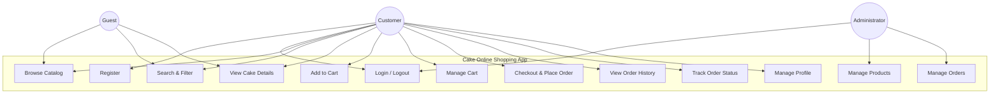
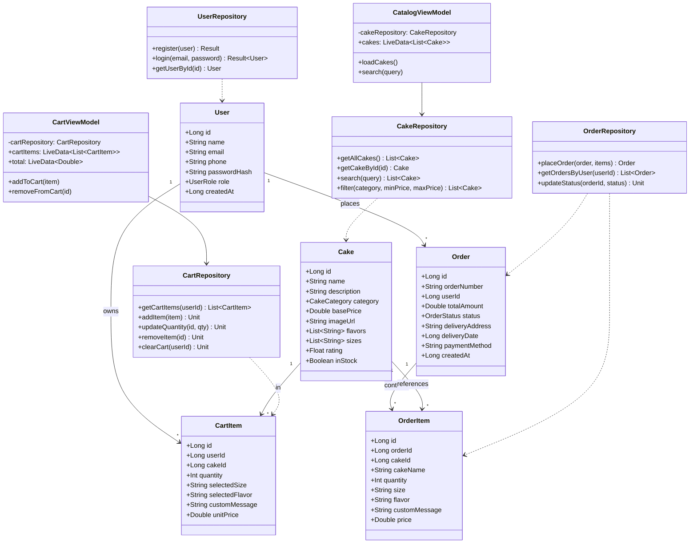
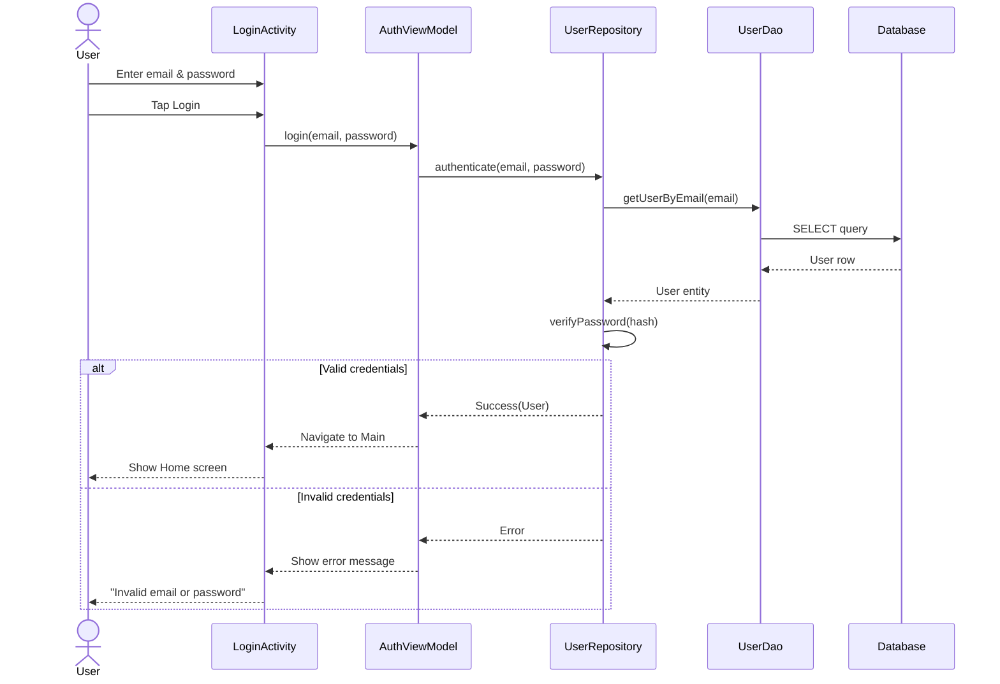
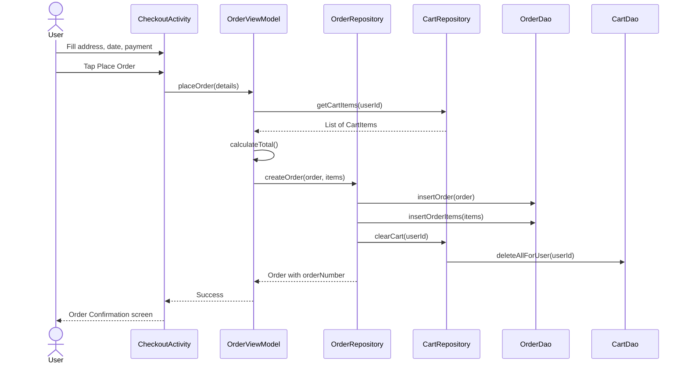
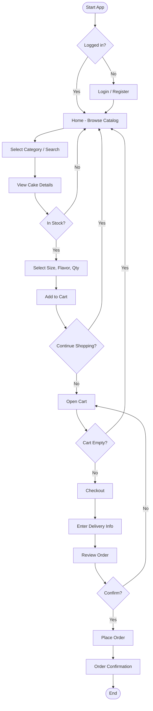
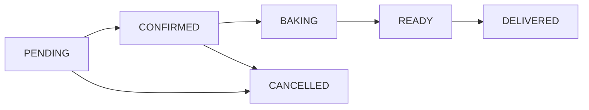
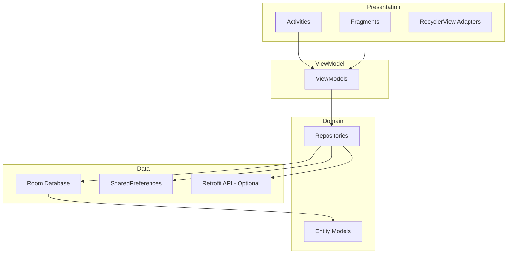
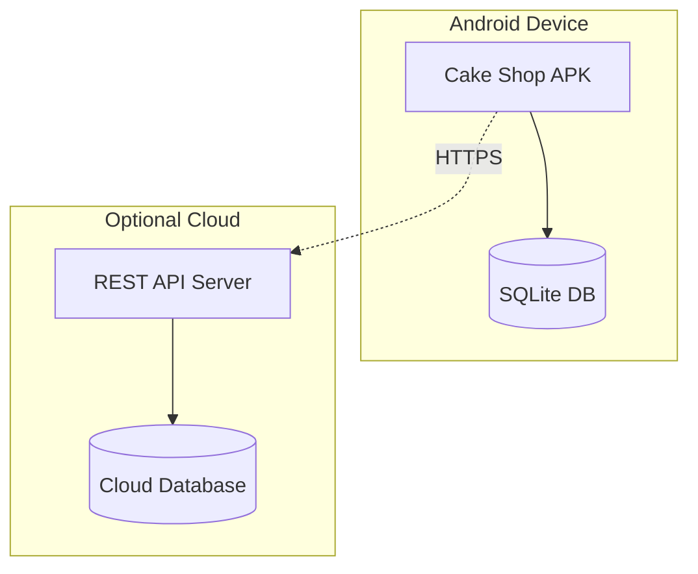
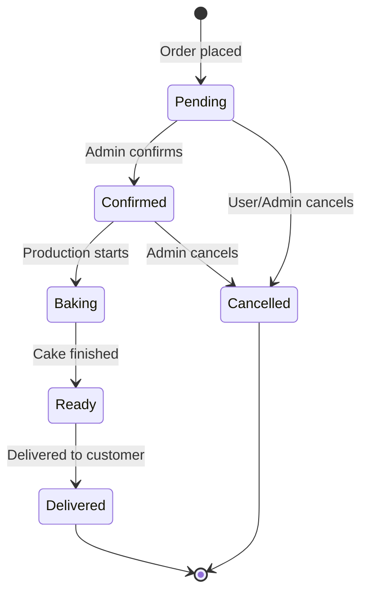

# UML Diagrams

## Cake Online Shopping Android App

**Document ID:** UML-CAKE-001  
**Version:** 1.0  
**Date:** June 2026

> Use [Mermaid Live Editor](https://mermaid.live) or Draw.io to render/export these diagrams for your report.

---

## 1. Use Case Diagram

---

## 2. Use Case Descriptions

### UC-01: Register Account

| Field | Description |
|-------|-------------|
| **Actor** | Customer |
| **Precondition** | App installed, user not logged in |
| **Main Flow** | 1. User opens Register screen 2. Enters name, email, phone, password 3. System validates input 4. System creates account 5. User redirected to Login or Home |
| **Alternate Flow** | 3a. Email already exists → show error 3b. Invalid email format → show validation error |
| **Postcondition** | New user record in database |

### UC-08: Place Order

| Field | Description |
|-------|-------------|
| **Actor** | Customer |
| **Precondition** | User logged in, cart not empty |
| **Main Flow** | 1. User opens Cart and taps Checkout 2. Enters delivery address and date 3. Selects payment method 4. Reviews order summary 5. Confirms order 6. System generates order ID and clears cart 7. Confirmation screen displayed |
| **Postcondition** | Order saved with PENDING status |

---

## 3. Class Diagram

---

## 4. Sequence Diagram — Login

---

## 5. Sequence Diagram — Place Order

---

## 6. Activity Diagram — Shopping Flow

---

## 7. Activity Diagram — Order Status (Admin)

---

## 8. Component Diagram

---

## 9. Deployment Diagram

---

## 10. State Diagram — Order Lifecycle

---

*Export diagrams as PNG/SVG for inclusion in Project Report and presentation slides.*
